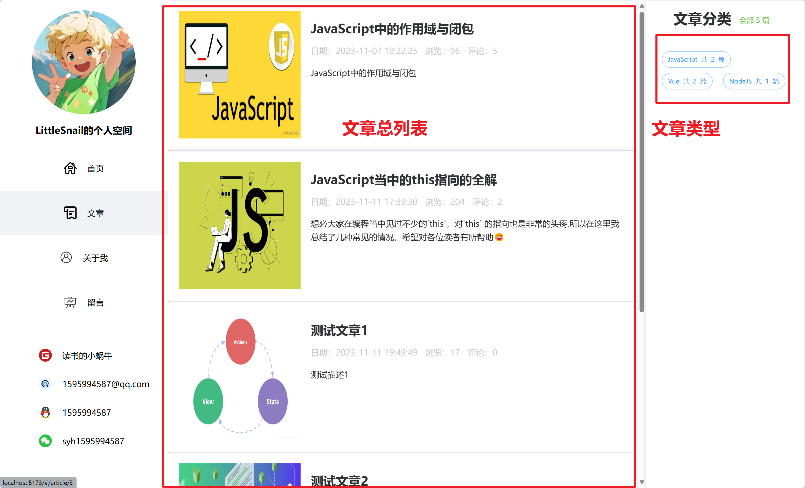
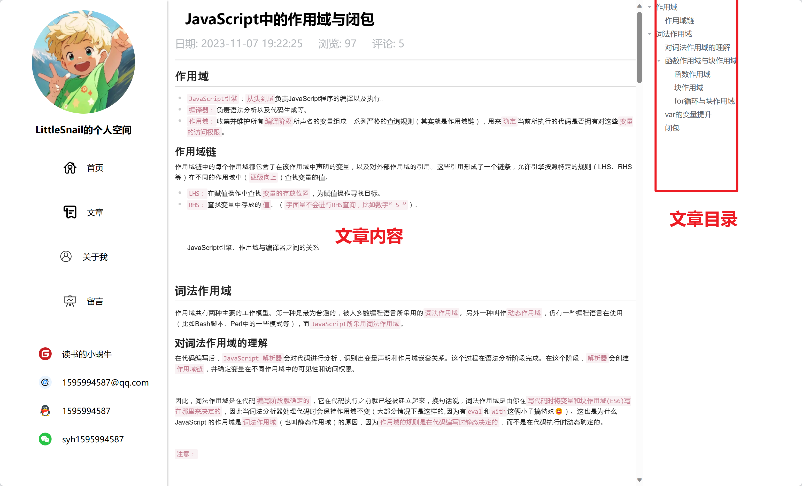
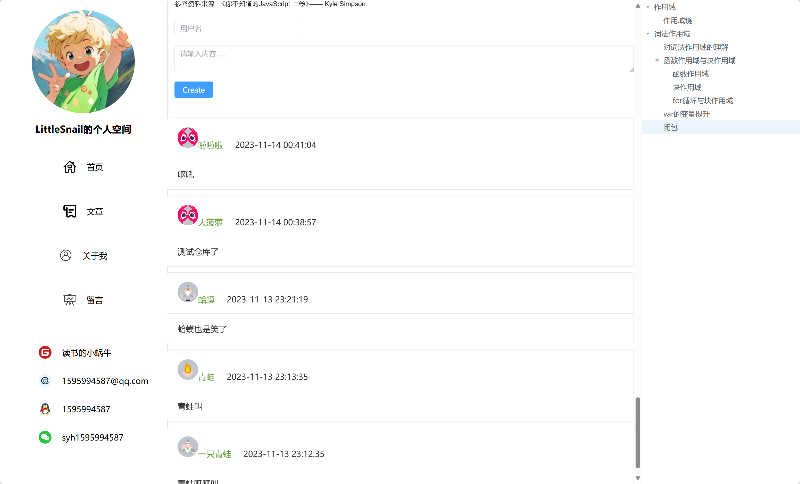
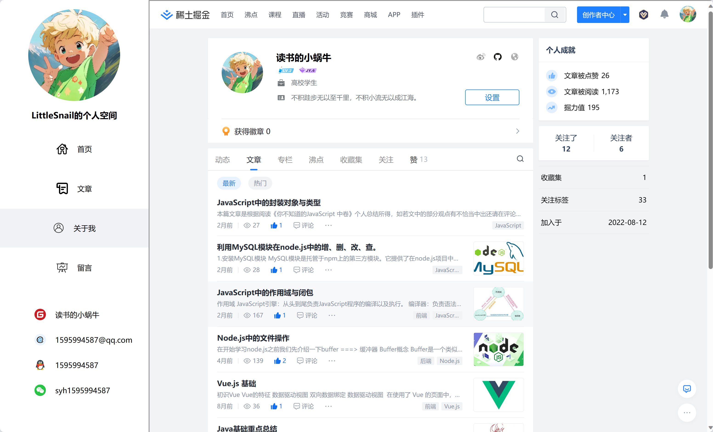
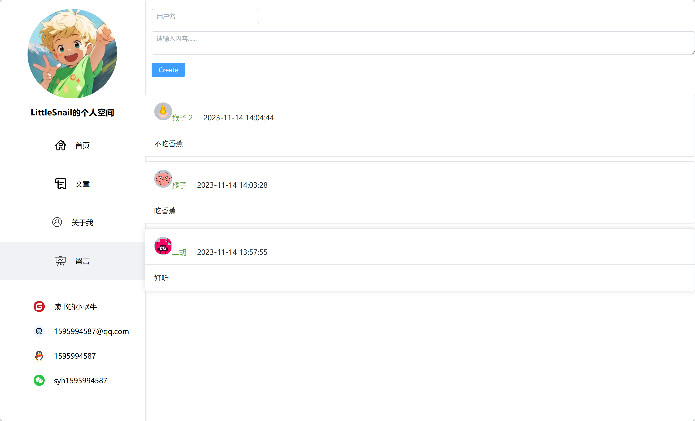

## 基于Vue3的个人博客

首页部分

---

文章列表展示

---

文章详情

---

文章评论

---

关于我部分

---

接收用户留言部分

## 技术栈

主要技术：

- Vue3

- Vite4

- Element Plus 组件库

- paina 2状态管理

依赖库：

- axios 网络请求
- dayjs时间处理
- toast-ui 处理markdown格式

